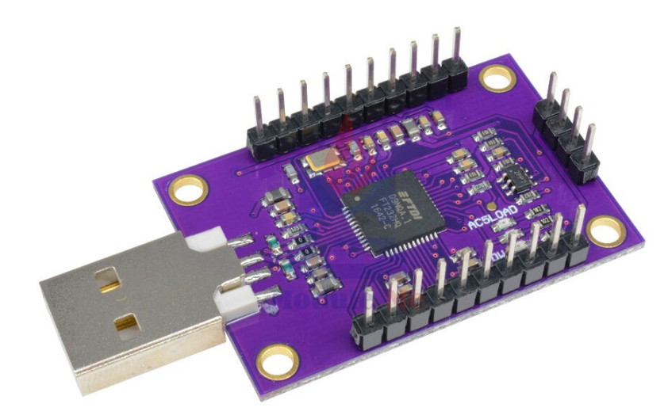

# Configuring JTAG debugging in Linux

See Espressif's [JTAG debugging guide](https://docs.espressif.com/projects/esp-idf/en/latest/esp32/api-guides/jtag-debugging/index.html#introduction).

## Required hardware

You will need a JTAG adapter to connect to the ESP32 debugging interface.

I was successful setting up JTAG debugging using this adapter, cjmcu-232h, which can be found cheaply in many online stores



It is based in the FT232H chip. Other adapters with this chip should also work. 

### FT232H pin mapping

JTAG in the ESP32 uses GPIO pins 12, 13, 14 and 15 so make sure you are not using them in your application.

Connect your ESP32 to the JTAG adapter this way:

* GPIO12 — AD1 (TDI)
* GPIO13 — AD0 (TCK)
* GPIO14 — AD3 (TMS)
* GPIO15 — AD2 (TDO)
* GND — GND

### Enabling the adapter in your system

Download `https://github.com/espressif/openocd-esp32/blob/master/contrib/60-openocd.rules`, place it in your `/etc/udev/rules.d` directory and reboot.

## Installing ESP-IDF SDK instance

Follow the [ESP32 Getting Started Guide](https://docs.espressif.com/projects/esp-idf/en/latest/esp32/get-started/index.html) to install an SDK instance in your system. We will use this SDK instance only for the debugging tools, not for building NodeMCU.

This will install the openocd version for NodeMCU (`openocd`) and the debugger (`xtensa-esp32-elf-gdb`)

## Debugging

OpenOCD needs to handle communication with the JTAG adapter and offer an interface that can be used by GDB. Thus, OpenOCD needs to always be running in the background, whether you use GDB directly, gdbui, Visual Studio Code, Eclipse or any other tool.

### Launching OpenOCD

Open a terminal, change to the SDK installation directory and execute:

`. export.sh`

Then, run `openocd`:

`openocd -f board/esp32-wrover-kit-3.3v.cfg`

If the JTAG connection with your device is successful, it will sit there listening for a connection from GDB.

### Debugging with gdbui

#### Preparation

In the NodeMCU repository root, create a `gdbinit` file with this content:

```
target remote :3333
set remote hardware-watchpoint-limit 2
mon reset halt
flushregs
thb app_main
c
```

#### Starting a debug session with gdbui

Open another terminal, change to the SDK installation directory and execute:

`. export.sh`

Then, change to de NodeMCU repository root and run:

`gdbgui --gdb xtensa-esp32-elf-gdb --gdb-args="-x gdbinit"`

A browser window will open, showing the debugger

### Configuring Visual Studio Code

Use the below as a template, replacing the `miDebuggerPath` key to the path to the downloaded SDK gdb debugger `xtensa-esp32-elf-gdb`, usually something like `$HOME/.espressif/tools/xtensa-esp32-elf/esp-2020r1-8.2.0/xtensa-esp32-elf/bin/xtensa-esp32-elf-gdb`

```json
{
    // Use IntelliSense to learn about possible attributes.
    // Hover to view descriptions of existing attributes.
    // For more information, visit: https://go.microsoft.com/fwlink/?linkid=830387
    "version": "0.2.0",
    "configurations": [
        {
            "name": "OpenOCD Debug",
            "type": "cppdbg",
            "request": "launch",
            "miDebuggerPath": "PATH TO xtensa-esp32-elf-gdb IN SDK",
            "program": "${workspaceFolder}/build/NodeMCU.elf",
            "setupCommands": [
                {
                    "description": "enable pretty printing for gdb",
                    "text": "-enable-pretty-printing",
                    "ignoreFailures": true
                },
                {
                    "text": "file '${workspaceFolder}/build/NodeMCU.elf'"
                },
                {
                    "text": "target remote :3333"
                },
                {
                    "text": "set remote hardware-watchpoint-limit 2",
                },
                {
                    "text": "flushregs"
                },
                {
                    "text": "monitor reset halt"
                },
                {
                    "text": "thb app_main"
                }
            ],
            "cwd": "${workspaceFolder}",
            "externalConsole": false
        }
    ]
}

```

You can then launch this configuration and debug as normal.

Sometimes, the session does not connect. Usually works if you try again.

## Other useful links:

https://medium.com/@manuel.bl/low-cost-esp32-in-circuit-debugging-dbbee39e508b

https://dzone.com/articles/jtag-debugging-the-esp32-with-ft2232-and-openocd
