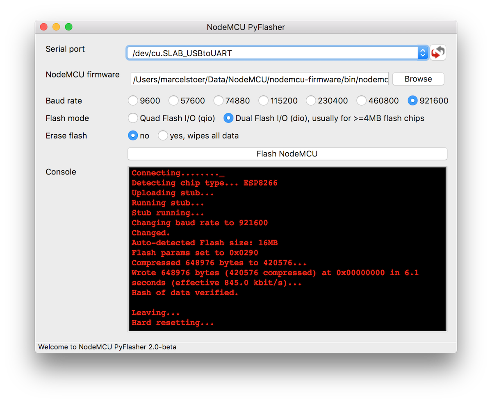

Below you'll find all necessary information to flash a NodeMCU firmware binary to ESP8266 or ESP8285. Note that this is a reference documentation and not a tutorial with fancy screen shots. Turn to your favorite search engine for those. Make sure you follow a recent tutorial rather than one that is several months old!

!!! attention

    Keep in mind that the ESP8266 needs to be [put into flash mode](#putting-device-into-flash-mode) before you can flash a new firmware!

!!! important

    When switching between NodeMCU versions, see the notes about
    [Upgrading Firmware](#upgrading-firmware).

## Tool overview

### esptool.py
> A Python-based, open source, platform independent, utility to communicate with the ROM bootloader in Espressif ESP8266.

Source: [https://github.com/espressif/esptool](https://github.com/espressif/esptool)

Supported platforms: OS X, Linux, Windows, anything that runs Python

**Running esptool.py**

Run the following command to flash an *aggregated* binary as is produced for example by the [cloud build service](build.md#cloud-build-service) or the [Docker image](build.md#docker-image).

`esptool.py --port <serial-port-of-ESP8266> write_flash -fm <flash-mode> 0x00000 <nodemcu-firmware>.bin`

[`flash-mode`](https://github.com/espressif/esptool/#flash-modes) is `qio` for most ESP8266 ESP-01/07 (512&nbsp;kByte modules) and `dio` for most ESP32 and ESP8266 ESP-12 (>=4&nbsp;MByte modules). ESP8285 requires `dout`.

**Gotchas**

- See [below](#determine-flash-size) if you don't know or are uncertain about the capacity of the flash chip on your device. It might help to double check as e.g. some ESP-01 modules come with 512kB while others are equipped with 1MB.
- esptool.py is under heavy development. It's advised you run the latest version (check with `esptool.py version`). Since this documentation may not have been able to keep up refer to the [esptool flash modes documentation](https://github.com/themadinventor/esptool#flash-modes) for current options and parameters.
- The firmware image file contains default settings `dio` for flash mode and `40m` for flash frequency.
- In some uncommon cases, the [SDK init data](#sdk-init-data) may be invalid and NodeMCU may fail to boot. The easiest solution is to fully erase the chip before flashing:
`esptool.py --port <serial-port-of-ESP8266> erase_flash`

### NodeMCU PyFlasher
> Self-contained [NodeMCU](https://github.com/nodemcu/nodemcu-firmware) flasher with GUI based on [esptool.py](https://github.com/espressif/esptool) and [wxPython](https://www.wxpython.org/).



Source: [https://github.com/marcelstoer/nodemcu-pyflasher](https://github.com/marcelstoer/nodemcu-pyflasher)

Supported platforms: anything that runs Python, runnable .exe available for Windows and .dmg for macOS

Disclaimer: the availability of [NodeMCU PyFlasher was announced on the NodeMCU Facebook page](https://www.facebook.com/NodeMCU/posts/663197460515251) but it is not an official offering of the current NodeMCU firmware team.

### NodeMCU Flasher
> A firmware Flash tool for NodeMCU...We are working on next version and will use QT framework. It will be cross platform and open-source.

Source: [https://github.com/nodemcu/nodemcu-flasher](https://github.com/nodemcu/nodemcu-flasher)

Supported platforms: Windows

Note that this tool was created by the initial developers of the NodeMCU firmware. **It hasn't seen updates since September 2015** and is not maintained by the current NodeMCU *firmware* team. Be careful to not accidentally flash the very old default firmware the tool is shipped with.

## Putting Device Into Flash Mode

To enable ESP8266 firmware flashing GPIO0 pin must be pulled low before the device is reset. Conversely, for a normal boot, GPIO0 must be pulled high or floating.

If you have a [NodeMCU dev kit](https://github.com/nodemcu/nodemcu-devkit-v1.0) then you don't need to do anything, as the USB connection can pull GPIO0 low by asserting DTR and reset your board by asserting RTS.

If you have an ESP-01 or other device without built-in USB, you will need to enable flashing yourself by pulling GPIO0 low or pressing a "flash" switch, while powering up or resetting the module.

## Which Files To Flash

If you build your firmware with the [cloud builder or the Docker image](build.md), or any other method that produces a *combined binary*, then you can flash that file directly to address 0x00000.

Otherwise, if you built your own firmware from source code:

- `bin/0x00000.bin` to 0x00000
- `bin/0x10000.bin` to 0x10000

## Upgrading Firmware

There are three potential issues that arise from upgrading (or downgrading!) firmware from one NodeMCU version to another:

* Lua scripts written for one NodeMCU version (like 0.9.x) may not work error-free on a more recent firmware.  For example, Espressif changed the `socket:send` operation to be asynchronous i.e. non-blocking. See [API documentation](modules/net.md#netsocketsend) for details.

* The NodeMCU flash file system may need to be reformatted, particularly if its address has changed because the new firmware is different in size from the old firmware.  If it is not automatically formatted then it should be valid and have the same contents as before the flash operation. You can still run [`file.format()`](modules/file.md#fileformat) manually to re-format your flash file system. You will know if you need to do this if your flash files exist but seem empty, or if data cannot be written to new files. However, this should be an exceptional case.
Formatting a file system on a large flash device (e.g. the 16MB parts) can take some time. So, on the first boot, you shouldn't get worried if nothing appears to happen for a minute. There's a message printed to console to make you aware of this.

* The Espressif SDK Init Data may change between each NodeMCU firmware version, and may need to be erased or reflashed.  See [SDK Init Data](#sdk-init-data) for details.  Fully erasing the module before upgrading firmware will avoid this issue.

## SDK Init Data

!!! note

    Normally, NodeMCU will take care of writing the SDK init data when needed. Most users can ignore this section.

NodeMCU versions are compiled against specific versions of the Espressif SDK. The SDK reserves space in flash that is used to store calibration and other data. This data changes between SDK versions, and if it is invalid or not present, the firmware may not boot correctly. Symptoms include messages like `rf_cal[0] !=0x05,is 0xFF`, or endless reboot loops and/or fast blinking module LEDs.

!!! tip

    If you are seeing one or several of the above symptoms, ensure that your chip is fully erased before flashing, for example:

    `esptool.py --port <serial-port-of-ESP8266> erase_flash`

    Also verify that you are using an up-to-date NodeMCU release, as some early releases of NodeMCU 1.5.4.1 did not write the SDK init data to a freshly erased chip.

Espressif refers to this area as "System Param" and it resides in the last four 4&nbsp;kB sectors of flash. Since SDK 1.5.4.1 a fifth sector is reserved for RF calibration (and its placement is controlled by NodeMCU) as described by this [patch notice](http://bbs.espressif.com/viewtopic.php?f=46&t=2407). At minimum, Espressif states that the 4th sector from the end needs to be flashed with "init data", and the 2nd sector from the end should be blank.

The default init data is provided as part of the SDK in the file `esp_init_data_default.bin`. NodeMCU will automatically flash this file to the right place on first boot if the sector appears to be empty.

If you need to customize init data then first download the [Espressif SDK 2.2.0](https://github.com/espressif/ESP8266_NONOS_SDK/archive/v2.2.0.zip) and extract `esp_init_data_default.bin`. Then flash that file just like you'd flash the firmware. The correct address for the init data depends on the capacity of the flash chip. 

- `0x7c000` for 512 kB, modules like most ESP-01, -03, -07 etc.
- `0xfc000` for 1 MB, modules like ESP8285, PSF-A85, some ESP-01, -03 etc.
- `0x1fc000` for 2 MB
- `0x3fc000` for 4 MB, modules like ESP-12E, NodeMCU devkit 1.0, WeMos D1 mini
- `0x7fc000` for 8 MB
- `0xffc000` for 16 MB, modules like WeMos D1 mini pro

See "4.1 Non-FOTA Flash Map" and "6.3 RF Initialization Configuration" of the [ESP8266 Getting Started Guide](https://espressif.com/en/support/explore/get-started/esp8266/getting-started-guide) for details on init data addresses and customization.

## Determine flash size

To determine the capacity of the flash chip *before* a firmware is installed you can run

`esptool.py --port <serial-port> flash_id`

It will return a manufacturer ID and a chip ID like so:

```
Connecting...
Manufacturer: e0
Device: 4016
```
The chip ID can then be looked up in [https://review.coreboot.org/cgit/flashrom.git/tree/flashchips.h](https://review.coreboot.org/cgit/flashrom.git/tree/flashchips.h). This leads to a manufacturer name and a chip model name/number e.g. `AMIC_A25LQ032`. That information can then be fed into your favorite search engine to find chip descriptions and data sheets.

By convention the last two or three digits in the module name denote the capacity in megabits. So, `A25LQ032` in the example above is a 32Mb(=4MB) module.
