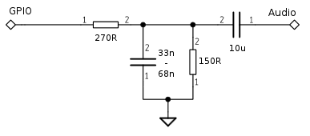

# pcm module
| Since  | Origin / Contributor  | Maintainer  | Source  |
| :----- | :-------------------- | :---------- | :------ |
| 2016-06-05 | [Arnim Läuger](https://github.com/devsaurus) | [Arnim Läuger](https://github.com/devsaurus) | [pcm.c](../../../app/modules/pcm.c)|

Play sounds through various back-ends.

## Sigma-Delta hardware

The ESP contains a sigma-delta generator that can be used to synthesize audio with the help of an external low-pass filter. All regular GPIOs (except GPIO0) are able to output the digital waveform, though there is only one single generator.

The external filter circuit is shown in the following schematic. Note that the voltage divider resistors limit the output voltage to 1&nbsp;V<sub>PP</sub>. This should match most amplifier boards, but cross-checking against your specific configuration is required.




!!! important

    This driver shares hardware resources with other modules. Thus you can't operate it in parallel to the `sigma delta`, `perf`, or `pwm` modules. They require the sigma-delta generator and the hw_timer, respectively.


## Audio format
Audio is expected as a mono raw unsigned 8&nbsp;bit stream at sample rates between 1&nbsp;k and 16&nbsp;k samples per second. Regular WAV files can be converted with OSS tools like [Audacity](http://www.audacityteam.org/) or [SoX](http://sox.sourceforge.net/). Adjust the volume before the conversion.
```
sox jump.wav -r 8000 -b 8 -c 1 jump_8k.u8
```

Also see [play_file.lua](../../../lua_examples/pcm/play_file.lua) in the examples folder.

## pcm.new()
Initializes the audio driver.

### Sigma-Delta driver

#### Syntax
`pcm.new(pcm.SD, pin)`

#### Parameters
`pcm.SD` use sigma-delta hardware
- `pin` 1~10, IO index

#### Returns
Audio driver object.

# Audio driver sub-module
Each audio driver exhibits the same control methods for playing sounds.

## pcm.drv:close()
Stops playback and releases the audio hardware.

#### Syntax
`drv:close()`

#### Parameters
none

#### Returns
`nil`

## pcm.drv:on()
Register callback functions for events.

#### Syntax
`drv:on(event[, cb_fn[, freq]])`

#### Parameters
- `event` identifier, one of:
	- `data` callback function is supposed to return a string containing the next chunk of data.
	- `drained` playback was stopped due to lack of data. The last 2 invocations of the `data` callback didn't provide new chunks in time (intentionally or unintentionally) and the internal buffers were fully consumed.
	- `paused` playback was paused by `pcm.drv:pause()`.
	- `stopped` playback was stopped by `pcm.drv:stop()`.
	- `vu` new peak data, `cb_fn` is triggered `freq` times per second (1 to 200 Hz).
- `cb_fn` callback function for the specified event. Unregisters previous function if omitted. First parameter is `drv`, followed by peak data for `vu` callback.

#### Returns
`nil`

## pcm.drv:play()
Starts playback.

#### Syntax
`drv:play(rate)`

#### Parameters
`rate` sample rate. Supported are `pcm.RATE_1K`, `pcm.RATE_2K`, `pcm.RATE_4K`, `pcm.RATE_5K`, `pcm.RATE_8K`, `pcm.RATE_10K`, `pcm.RATE_12K`, `pcm.RATE_16K` and defaults to `RATE_8K` if omitted.

#### Returns
`nil`

## pcm.drv:pause()
Pauses playback. A call to `drv:play()` will resume from the last position.

#### Syntax
`drv:pause()`

#### Parameters
none

#### Returns
`nil`

## pcm.drv:stop()
Stops playback and releases buffered chunks.

#### Syntax
`drv:stop()`

#### Parameters
none

#### Returns
`nil`
