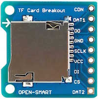
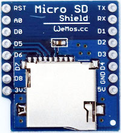

# FAT File System on SD Card

Accessing files on external SD cards is currently only supported from the `file` module. This imposes the same overall restrictions of internal SPIFFS to SD cards:

- no support for sub-folders
- no timestamps
- no file attributes (read-only, system, etc.)

Work is in progress to extend the `file` API with support for the missing features.

## Enabling FatFs

The FAT file system is implemented by [Chan's FatFs](http://elm-chan.org/fsw/ff/00index_e.html) version [R0.12a](http://elm-chan.org/fsw/ff/ff12a.zip). It's disabled by default to save memory space and has to be enabled before compiling the firmware:

Uncomment `#define BUILD_FATFS` in [`user_config.h`](../../app/include/user_config.h).

## SD Card connection

The SD card is operated in SPI mode, thus the card has to be wired to the respective ESP pins of the HSPI interface. There are several naming schemes used on different adapters - the following list shows alternative terms:

- `CK, CLK, SCLK` to pin5 / GPIO14
- `DO, DAT0, MISO` to pin 6 / GPIO12
- `DI, CMD, MOSI` to pin 7 / GPIO13
- `CS, DAT3, SS` to pin 8 / GPIO15 recommended
- `VCC, VDD` to 3V3 supply
- `VSS, GND` to common ground

Connection of `SS/CS` can be done to any of the GPIOs on pins 1 to 12. This allows coexistence of the SD card with other SPI slaves on the same bus. There's no support for detection of card presence or the write protection switch. These would need to be handled as additional GPIOs in the user application.

!!! caution

    The adapter does not require level shifters since SD and ESP are supposed to be powered with the same voltage. If your specific model contains level shifters then make sure that both sides can be operated at 3V3.




## Lua bindings

Before mounting the volume(s) on the SD card, you need to initialize the SPI interface from Lua.

```lua
spi.setup(1, spi.MASTER, spi.CPOL_LOW, spi.CPHA_LOW, 8, 8)

-- initialize other spi slaves

-- then mount the sd
-- note: the card initialization process during `file.mount()` will set spi divider temporarily to 200 (400 kHz)
-- it's reverted back to the current user setting before `file.mount()` finishes
vol = file.mount("/SD0", 8)   -- 2nd parameter is optional for non-standard SS/CS pin
if not vol then
  print("retry mounting")
  vol = file.mount("/SD0", 8)
  if not vol then
    error("mount failed")
  end
end
file.open("/SD0/path/to/somefile")
print(file.read())
file.close()
```

!!! note

    If the card doesn't work when calling `file.mount()` for the first time then re-try the command. It's possible that certain cards time out during the first initialization after power-up.

The logical drives are mounted at the root of a unified directory tree where the mount points distinguish between internal flash (`/FLASH`) and the card's partitions (`/SD0` to `/SD3`). Files are accessed via either the absolute hierarchical path or relative to the current working directory. It defaults to `/FLASH` and can be changed with `file.chdir(path)`.

Subdirectories are supported on FAT volumes only.

## Multiple partitions / multiple cards

The mapping from logical volumes (eg. `/SD0`) to partitions on an SD card is defined in [`fatfs_config.h`](../../app/include/fatfs_config.h). More volumes can be added to the `VolToPart` array with any combination of physical drive number (aka SS/CS pin) and partition number. Their names have to be added to `_VOLUME_STRS` in [`ffconf.h`](../../app/fatfs/ffconf.h) as well.
