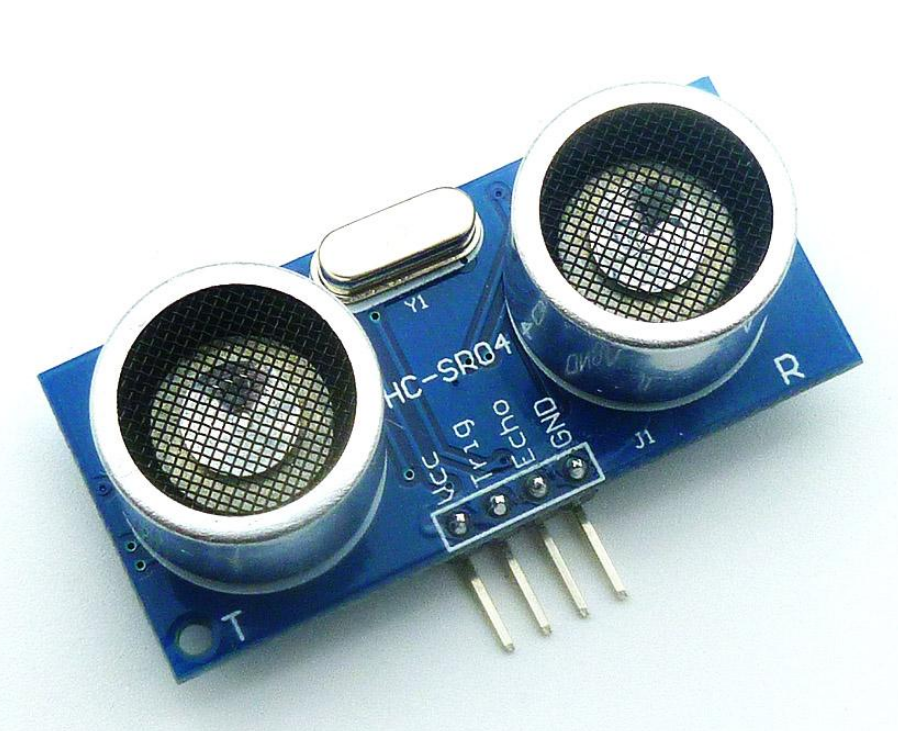
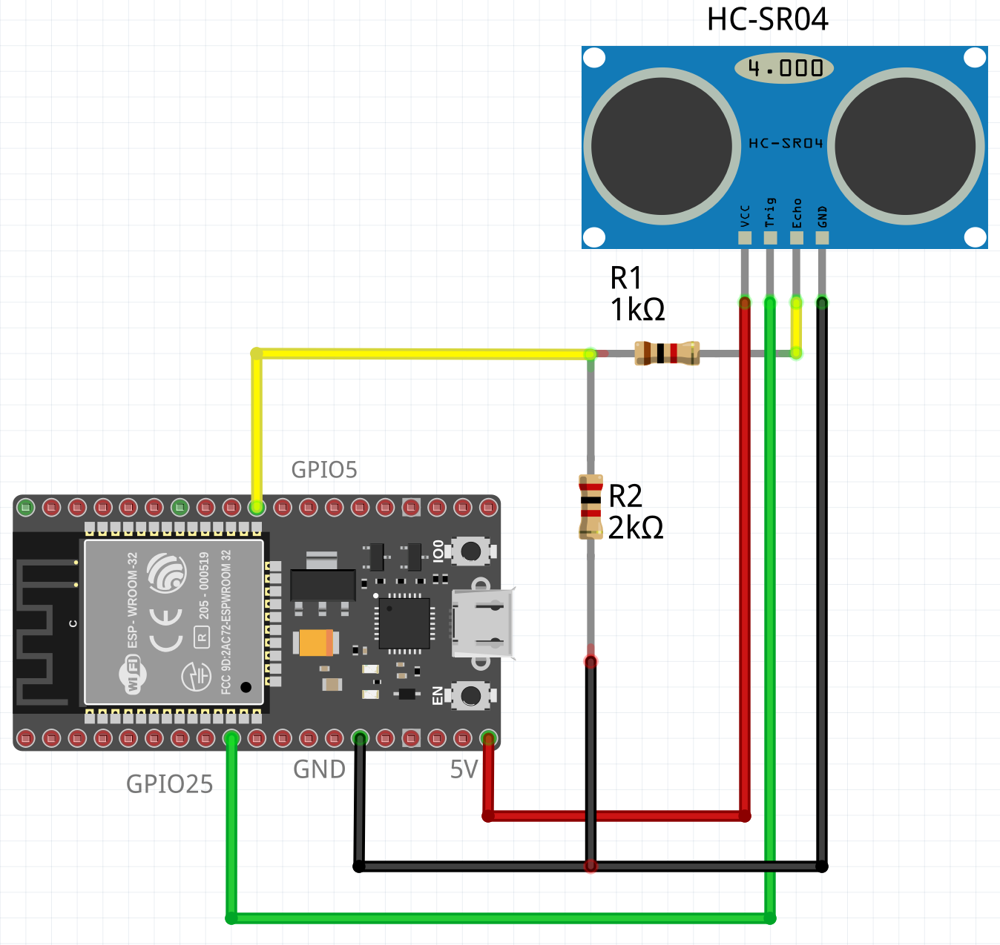

# Sonar Module
| Since      | Origin / Contributor                            | Maintainer | Source                                      |
| :--------- | :---------------------------------------------- | :--------- | :------------------------------------------ |
| 2020-05-06 | [Javier Peletier](https://github.com/jpeletier) |            | [sonar.c](../../components/modules/sonar.c) |

This module drives the typical ultrasound based sonars, such as the HC-SR04. These sensors are activated by a "trig" pin that must be held high for a few microseconds. Then, an ultrasound is emitted and when it bounces back some surface, an echo is received. The sensor sends back to the microcontroller a pulse as long as the time it took for the echo to come back. Distance can be then calculated by multiplying the total travel time by the speed of sound.


You can learn more about this sensor [in this detailed guide](https://lastminuteengineers.com/arduino-sr04-ultrasonic-sensor-tutorial/).

## ESP32/ESP-IDF implementation details

Internally, this module uses the RMT infrared driver hardware present in ESP32 for accurate pulse measurement. Each sonar object takes two RMT channels, one for sending and another for receiving. There are 8 RMT channels in ESP32, so up to 4 sonars can be driven simultaneously. Code could be optimized to share these channels in the future.

# Hardware connection:

Connecting this sensor takes 2 GPIO pins. One to send the trigger signal and the other to listen to the echo pulse.

HC-SR04 is driven by 5V, therefore care must be taken to bring down the echo signal to the 3.3V the ESP32 operates at, for example with a simple voltage divider in which `R2 = 2*R1`

You can follow this schematic as a guide:



# LUA API

## Example
```lua
t = tmr.create()
s = sonar.new(25, 5)
t:alarm(500, tmr.ALARM_AUTO, function()
    s:ping(function(d)
        if d == sonar.DISTANCE_OUT_OF_RANGE then
            print("no obstacle detected")
        else
            print("distance to obstacle:", d)
        end
    end)
end)
t:start()
```

## sonar.new()

Creates a sonar driver.

#### Syntax
`sonar.new(trigPin, echoPin)`

#### Parameters
- `trigPin` GPIO pin connected to HC-SR04 Trig pin
- `echoPin` GPIO pin connected to HC-SR04 Echo pin

#### Returns
Sonar object (sonarObj) that exports the `ping()` method.

## sonarObj:ping()

Sends out a sonar ping. The callback will be invoked passing the distance in mm as the only parameter, or the special constant `sonar.DISTANCE_OUT_OF_RANGE` if no obstacle is detected.

#### Syntax
`sonar.ping(callback)`

#### Parameters
- `callback`: Function that will be called when the ping bounces back or no echo is detected.

#### Returns
nothing

